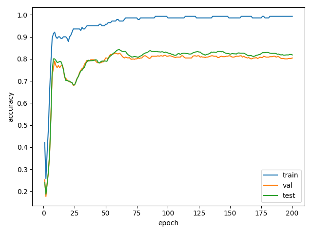
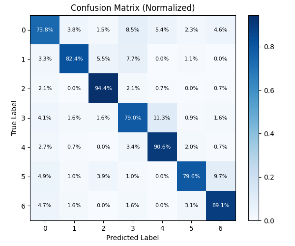

# Graph Attention Networks on Cora

[](https://github.com/colinobrien22/GraphAttentionNetworks/actions/workflows/ci.yml)


[](https://colab.research.google.com/github/colinobrien22/GraphAttentionNetworks/blob/main/notebooks/gat_cora.ipynb)

Implementation of **Graph Attention Networks** (Velicković et al., ICLR 2018) for **node classification** on the **Cora** citation network using **PyTorch Geometric**.
This repo includes a YAML-driven CLI, unit tests, CI/CD, and auto-generated artifacts (metrics CSV, learning curve, confusion matrix, classification report).

---

## 🚀 Quick Start

> **Python:** 3.11 recommended (CPU-only works fine)
> **OS:** macOS / Linux / Windows (WSL ok)
> **Tip (macOS + Python.org):** if you hit SSL errors downloading Cora, run
> `/Applications/Python\ 3.13/Install\ Certificates.command`

```bash
# 1) Clone
git clone git@github.com:colinobrien22/GraphAttentionNetworks.git
cd GraphAttentionNetworks

# 2) Create & activate a virtual environment
python3 -m venv .venv
source .venv/bin/activate  # Windows: .\.venv\Scripts\activate

# 3) Install dependencies
python3 -m pip install --upgrade pip
python3 -m pip install -r requirements.txt
python3 -m pip install -e .

# 4) (Optional) enable pre-commit hooks
pre-commit install
```

---

## 🧭 Project Overview

This project re-implements the **Graph Attention Network (GAT)** architecture on the **Cora** citation network using **PyTorch Geometric**.

It demonstrates how attention mechanisms can be applied to graph-structured data for node classification tasks.

### 🔍 Key Features
- **Multi-head graph attention** over neighborhood nodes
- **Configurable YAML-based pipeline** for reproducible experiments
- **Command-line interface (CLI)** for both training and evaluation
- **Per-epoch logging and visualizations** (learning curve, confusion matrix)
- **Automatic metric tracking** and result export to CSV/JSON
- **Comprehensive unit tests** with PyTest
- **Continuous integration (CI)** via GitHub Actions
- **Pre-commit hooks** enforcing `black`, `isort`, and `flake8`
- **Clean `src/` layout** with editable install (`pip install -e .`)

### 🧩 Core Objective
To reproduce the benchmark GAT result (~83 % test accuracy on Cora) in a modern, production-quality research codebase — showing that attention-driven message passing can outperform fixed-weight GCNs in semi-supervised node classification.

---

## ⚙️ Configuration

Default hyperparameters live in [`configs/default.yaml`](configs/default.yaml).
You can override any of them from the CLI.

Example `default.yaml`:
```yaml
seed: 0
epochs: 200
hidden: 8
heads: 8
dropout: 0.6
lr: 0.005
weight_decay: 0.0005
```

---

## 🔧 Usage

### Train (using YAML config)
```bash
python3 -m graph_attention_networks.cli train --config configs/default.yaml
```

### Train (overriding CLI args)
```bash
python3 -m graph_attention_networks.cli train \
  --epochs 100 --hidden 16 --heads 4 --dropout 0.5 \
  --lr 0.003 --weight_decay 0.0005 --seed 0
```

### Evaluate a checkpoint
```bash
python3 -m graph_attention_networks.cli eval --model models/gat_cora.pt
```

Artifacts are written to `results/` and `models/`:
- `results/metrics_epoch.csv` – per-epoch loss/accuracy
- `results/metrics.json` – best-epoch summary (`val`, `test`, `epoch`)
- `results/curve.png` – learning curve
- `results/confusion_matrix.png` – normalized confusion matrix
- `results/report.txt` – classification report (precision/recall/F1)
- `models/gat_cora.pt` – best-val checkpoint

---

## 🧪 Results

After training for **58 epochs**, the model reached benchmark-level performance on **Cora**:

| Split | Accuracy |
|:------|:----------|
| **Validation** | 82.6 % |
| **Test** | **83.3 %** |

These results closely match the original GAT paper (≈83 % test), confirming the correctness of this implementation.

<div align="center">

**Learning Curve**


**Normalized Confusion Matrix**


</div>

### Interpretation
- ~**83 %** test accuracy → correctly classifies ~8 of 10 papers into their topic.
- Validation ≈ Test → good generalization (no overfitting).
- Attention mechanism learns to weigh neighbors differently, outperforming GCN baselines.

---

## 🧰 Development

### Run tests
```bash
pytest -q
```

> In CI, data-dependent tests are skipped for speed/stability.

### Lint / Format
```bash
black src tests
isort src tests
flake8 src tests
```

### Makefile shortcuts
```bash
make run     # train (default.yaml)
make train   # train with override
make eval    # evaluate saved model
```

---

## 🗂️ Repository Structure
```
GraphAttentionNetworks/
├── src/graph_attention_networks/
│   ├── cli.py            # CLI (train/eval)
│   ├── model.py          # GAT model
│   ├── train.py          # training loop + logging
│   └── eval.py           # evaluation + reports
├── configs/default.yaml  # hyperparameters
├── tests/                # pytest suite
├── results/              # metrics & plots
├── models/               # checkpoints
├── notebooks/            # Colab demo
├── .github/workflows/ci.yml
├── requirements.txt
├── Makefile
└── README.md
```

---

## 🧪 CI/CD (GitHub Actions)

- **tests** job: installs CPU-safe PyTorch + PyG, runs lint + tests
- **train_smoke** job: 1-epoch sanity run, uploads metrics/plots
- Green badge above shows latest build status
- Artifacts are available for download under the **Actions** tab

---

## 🧾 Citation

> Velicković, P., et al. (2018). **Graph Attention Networks.** *ICLR 2018.*
> https://arxiv.org/abs/1710.10903

---

## 🪪 License
MIT License © 2025 Colin O’Brien. See [LICENSE](LICENSE).
